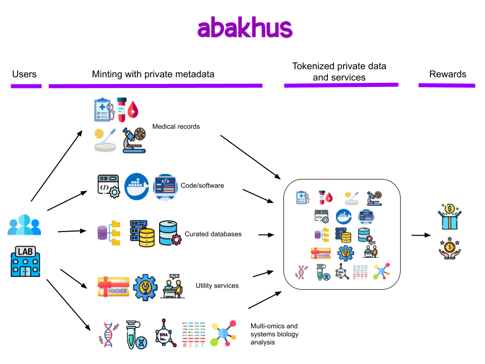

    @page { size: 8.5in 11in; margin: 1in } p { margin-bottom: 0.1in; direction: ltr; line-height: 115%; text-align: left; orphans: 2; widows: 2; background: transparent } a:link { color: #000080; so-language: zxx; text-decoration: underline }

**Abakhus : a privacy-preserving protocol for health and life sciences data and services**

  

**Alberto Dávila & Rodrigo Jardim**

https://abakhus.io

  

**Abstract.** Abakhus is a set of decentralized and interconnected privacy-preserving Health and Life Sciences data and services that leverage the full capabilities of Private Smart Contracts on Secret Network and IBC from the Cosmos Ecosystem. By making extensive use of private metadata, Abakhus is the world's first protocol to bring together in one place (a) clinical/veterinary laboratory specialists, (b) multi-omics, bioinformatics and systems biology specialists, (c) software developers in the health and life sciences space, (d) physicians and veterinarians and (e) end-users in need of clinical/veterinary/multiomics/systems biology services. Abakhus offers privacy-preserving services to clinical/veterinary laboratories, data analysis companies and end-users wishing to (i) tokenize medical/veterinary records, (ii) tokenize clinical/veterinary laboratory services, (iii) offer tokenized multi-omics or systems biology data analysis, (iv) offer tokenized code/software and (v) offer tokenized curated databases.

  

**Abakhus features**

  

\* Connecting to Abakhus: a Keplr ([https://www.keplr.app/](https://www.keplr.app/)) wallet is needed to access all tokenization and token adquisition services

\* Users: individuals, clinical/veterinary laboratories, genomics and multi-omics sequencing companies, data analysis companies

\* Extensive use of private metadata from customized SNIP721 secret smart contracts

\* Only token owners have access to their private metadata using their viewing keys

\* Medical/veterinary records can be tokenized only by whitelisted laboratories/companies

\* Code/Software and Curated Databases tokens listed on Abakhus bazaar will include royalties for their developers

\* Utility tokens will be displayed on the Abakhus bazaar only when minted by whitelisted users

**Privacy-preserving tokens**

  

Several privacy-preserving token types can be minted and listed on Abakhus bazaar

  

_Medical/veterinary records_

  

In 2021 the healthcare industry was worth US$38B in Brazil and US$2.7T in the USA alone. So it is correct to estimate that billions of medical and health records are issued each year worldwide and few healthcare systems (mostly the ones in the Northern Hemisphere) generate an electronic version of them. By adopting the encrypted and privacy-preserving features of Abakhus it is now possible for clinical/veterinary laboratories and physicians/veterinarians to issue an electronic version of medical and health records for every subject. Abakhus protocol offers the easy-to-use tokenization services needed to achieve this, including strong on-chain and off-chain encryption. End-users can share, monetize or delete the tokenized records they own, since only them will have access and control over them using their viewing keys.

  

_Code/software_

  

Hundreds of software for multi-omics and systems biology data analysis have been published in open source repositories as SourceForge and GitHub to date, most of them are used for free by specialists and only a few are used for commercial or for-profit purposes. By tokenizing the containerized version of the best and most widely used software, Abakhus aims not only to boost its service ecosystem but also to reward the software developers. Everytime an end-user pays to run a tokenized and containerized software listed in the Abakhus bazaar, the developers of that software will receive a small percentage of that payment as royalties to incentivize them to release improvements.

  

_Curated databases_

  

Most of the analysis used on multi-omics and systems biology data involves a comparison with at least one curated database, notably ClinGen, DECIPHER, UniRef, KEGG pathways, RefSeq, SILVA, CARD etc. Most of those database curation initiatives are funded by research grants from different sources then made available for free to end-users. By promoting the tokenization and listing of specialized curated databases in the Abakhus bazaar, we aim to promote further developments in the database curation space. Everytime an end-user pays to use a tokenized curated database listed in the Abakhus bazaar, the developers of the curated database will receive a small percentage of that payment as royalties to incentivize them to release improvements.

  

_Utility services_

  

Utility tokens are basically “tokenized vouchers”, meaning (i) end-users can tokenize consultancy services (eg multi-omics sequencing or systems biology experiments), (ii) clinical/veterinary laboratories can tokenize PCR, immunological and biochemical analysis services, DNA/RNA sequencing, vaccination services, (iii) bioinformatics and data science companies can tokenize specialized data analysis services, etc. While any user (individuals, laboratories and data analysis companies) will be able to tokenize services, they will need to be whitelisted in order to publicly list all those tokenized services in the Abakhus bazaar. The requirements to be whitelisted then able to list tokenized services in the Abakhus bazaar will be announced between Beta and Mainnet dates.

  

_Multi-omics and Systems Biology analysis_

  

It is well known there is much more multi-omics and systems biology data being generated than specialists trained to analyze them. The Broad Institute of MIT and Harvard alone generates >20Tb of genomics data every day ! By promoting the tokenization of multi-omics and systems biology analysis services in a decentralized way, Abakhus aims to create new opportunities for short-term and remote services, meaning well trained young researchers (including advanced PhD students and postdocs) could occasionally and remotely help to analyze that huge amount of data. Containerized software and curated databases will run on cloud-based decentralized servers that will receive encrypted primary/original/raw data then encrypt all the results to be sent back to Abakhus, finally all those results will be tokenized with private metadata then transferred to the end-user.

  

  

  

  

**Road Map**

  

_2022_

  

February: Initial development

August: Abakhus Hub front-end development

Mid-October: Alpha available for testnet

Late November: Beta available for end users

  

_2023_

  

Mainnet: Q1 2023

  

**Conceptual diagram**

  

